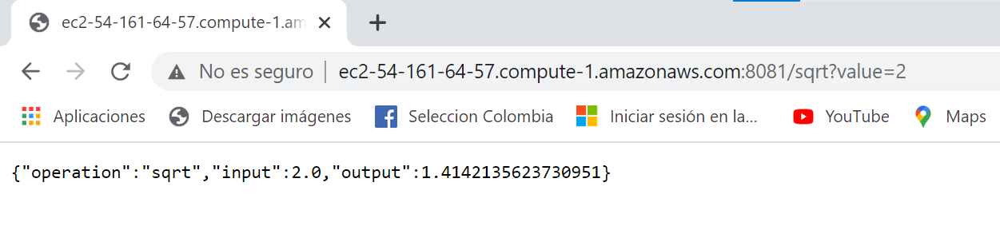

# EXAM SECOND TERM. 🚀

## Escuela Colombiana de Ingeniería - Enterprise Architectures(AREP).

Diseñé, construya y despliegue los siguientes servicios en un microcontenedor docker desplegado en una instancei a EC2 de AWS y otro desplegador en AWS lambda con AWS gateway. Cada estudiante debe seleccionar para desarrollar dos funciones matemáticas de acuerdo a los dos últimos dígitos de su cédula como se especifica en la lista (Si sus dos últimos dígitos de su cédula son el mismo use el siguiente dígito que sea diferente). Todas las funciones reciben un solo parámetro de tipo "Double" y retornan una parámetro de tipo "Double".

0. log

1. ln

2. sin

3. cos

4. tan

5. acos

6. asin

7. atan

8. sqrt

9. exp (el número de eauler elevado ala potendia del parámetro)


Implemente los servicios para responder al método de solicitud HTTP GET. Deben usar el nombre de la función especificado en la lista y el parámetro debe ser pasado en la variable de query con nombre "value".


Ejemplo de una llamado:

EC2
https://amazonxxx.x.xxx.x.xxx:{port}/cos?value=3.141592

Lambda + API Gateway
https://amazonxxx.x.xxx.x.xxx/sin?value=3.141592


Salida. El formato de la salida y la respuesta debe ser un JSON con el siguiente formato

{

 "operation": "cos",

 "input":  3.141592,

 "output":  -0.999999

}

## Getting Started

### Prerequisites

- [Maven](https://maven.apache.org/) - Dependency Management.

- [Java 8](https://www.oracle.com/co/java/technologies/javase/javase-jdk8-downloads.html) -  Development Environment.

- [Git](https://git-scm.com/) - Version Control System.

- [Spark](http://sparkjava.com/) - Micro framework for creating web applications in Java 8.

Make sure you have this programs installed correctly and the version that we need with the following commands:

```
mvn --version
```

```
git --version
```

```
java -showversion
```

### Installing

1. Clone the repository:

```
git clone https://github.com/angiedanielar/PARCIAL2_AREP
```

2. Compile the projet:

```
mvn package
```

3. Executing the program:

```
mvn exec:java -D "exec.mainClass"="edu.escuelaing.arep.app.App"
```
And put this link in your browser: http://localhost:4567

- Example to use: And put this link in your browser: http://localhost:4567/sqrt?value=2

5. Generating the documentation:

```
mvn javadoc:javadoc
```

## How to use

Mi cedula termina en 98, por lo tanto las funciones que implementé fueron sqrt y exp. En este repositorio esta sqrt y en este [otro repositorio](https://github.com/angiedanielar/PARCIAL2.1_AREP) esta exp.


- [Link to the deploy](http://ec2-54-161-64-57.compute-1.amazonaws.com:8081/)




## Built With

- [Maven](https://maven.apache.org/) - Dependency Management

- [Java 8](https://www.oracle.com/co/java/technologies/javase/javase-jdk8-downloads.html) -  Development Environment.

- [Git](https://git-scm.com/) - Version Control System.

- [Spark](http://sparkjava.com/) - Micro framework for creating web applications in Java 8.

## Author

- Angie Daniela Ruiz Alfonso.


## License

This project is under GNU General Public License - see the [LICENSE](LICENSE) file for details.

